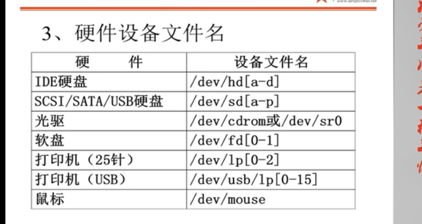
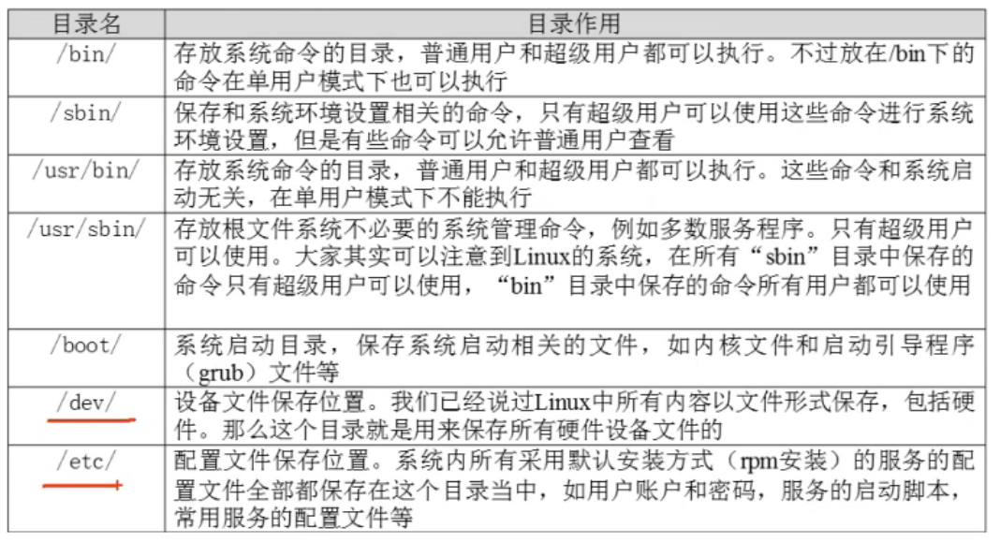
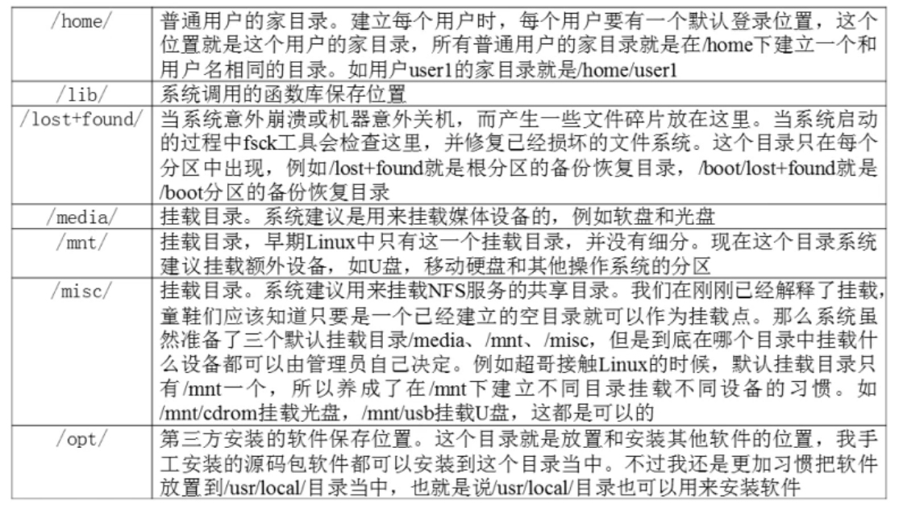
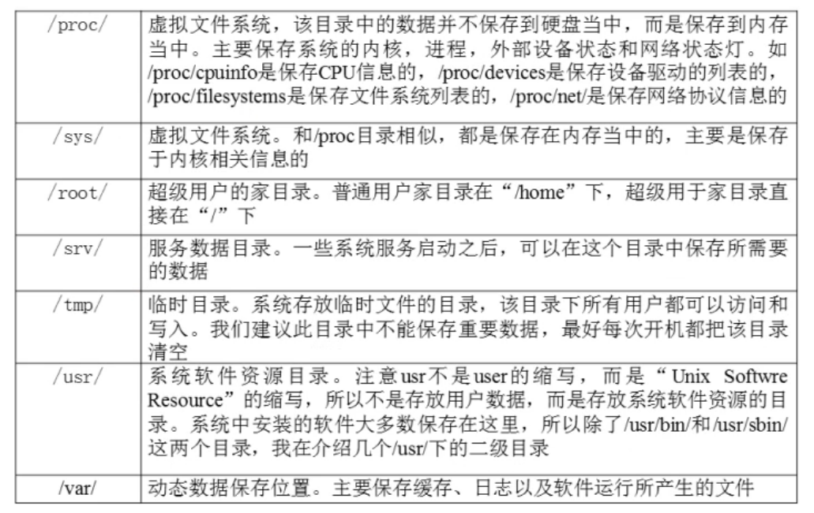
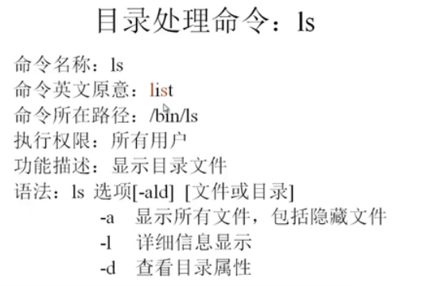
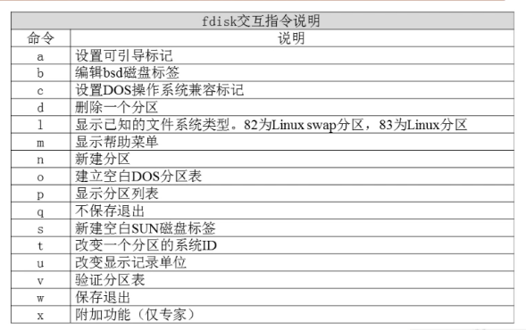
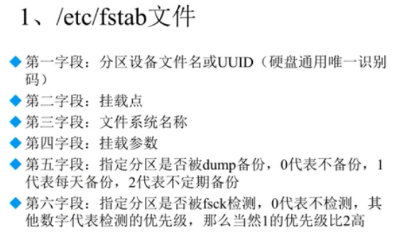
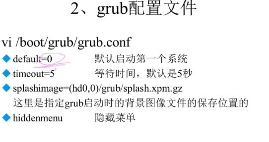

# Linux系统分区

1.磁盘分区。在磁盘上划分几个逻辑部分，碟片一旦划分成数个分区，不同类的目录与文件可以存储进不同的分区。【把衣柜划分为几个大区域】

分区类型：

- 主分区：最多只能有4个
- 扩展分区：最多只能有1个，主分区加扩展分区最多有4个，扩展分区不能写入数据，只能包含逻辑分区
- 逻辑分区：可以写入数据，如果是IDE硬盘，Linux最多支持59个逻辑分区，如果是SCSI则支持11个逻辑分区

2.格式化。 格式化又称逻辑格式化，它是指根据用户选定的文件系统，在磁盘的特定区域写入特定数据，在分区中划出一片用于存放文件分配表、目录等用于文件管理的磁盘空间。一般为ext4，最大1EB【衣柜每个区域进行划分】

3.硬件设备文件名



 4.分区设备文件名

/dev/hda1 (IDE硬盘接口)

/dev/sda1 （SCSI硬盘接口、SATA硬盘接口）

注意：一个硬盘1-4顺序号是分给主分区和扩展分区的，逻辑分区都是从5开始的，如sda5

4.挂载，Linux一切都是文件，必须挂载后才能使用

必须分区：/根分区；/swap交换分区，内存2倍，不超过2GB，swap是系统直接使用的，没有挂载点

推荐分区：/boot启动分区，200MB

文件系统结构例子（双系统）：sudo fdisk -l

/dev/sda1  *    92G  7 HPFS/NTFS/exFAT       #  win10 主分区，C盘，这个必须是1，否则会导致启动出错
/dev/sda2        839.5G  f W95 Ext'd (LBA)   #  win10扩展分区，不能写入数据，但是可以包含下面的DEF逻辑分区
/dev/sda5       280G  7 HPFS/NTFS/exFAT   #  win10逻辑分区盘D
/dev/sda6        280G  7 HPFS/NTFS/exFAT   #  win10逻辑分区盘E
/dev/sda7       179.5G  7 HPFS/NTFS/exFAT   #  win10逻辑分区盘F
/dev/sda8       380M 83 Linux   #  Linux boot挂载点，单独分了一个逻辑分区
/dev/sda9      7.6G 82 Linux swap / Solaris    #  Linux交换分区
/dev/sda10    28.6G 83 Linux    #  Linux根分区
/dev/sda11    63.4G 83 Linux   #  Linux home分区

# 文件系统常用命令

- 文件系统查看命令df。df [选项] [挂载点]

  -a	显示所有的文件系统信息，包括特殊文件系统，如/proc、/sysfs

  -h	以人性化的方式显示大小，如kb,mb

  -T	显示文件系统类型

  -m	以mb为单位显示容量

  -k	以kb为单位显示容量，默认就是以kb为单位

- 统计目录或文件大小（文件一般用ls,ls对目录只统计目录下一级文件大小）命令du。du [选项] [目录或文件名]

  -a	显示每个子文件的磁盘占用量，默认只统计子目录的磁盘占用量

  -h    以人性化查看

  -s	统计总占用量，而不列出子目录和子文件占用量

- df和du统计的数据是不同的：打个比方，文件是需要放到文件柜里的，就算只有一个文件，也要占用一个文件柜。文件柜占用的空间比文件要大。df就是统计使用了多少个文件柜。du则统计实际有多少个文件。这样下来，**df算的就大，du就小**。簡單地說，df命令是根據該卷的inode使用情況進行統計的，而du則是累加所有文件的字節數。一個文件就算只有1字節，也要佔用一個inode。

- 显示磁盘状态命令dumpe2fs。dumpe2fs 分区设备块名称

- 文件系统修复命令fsck[一般不用]。fsck [选项] 分区设备文件名

  -a	不用显示用户提示，自动修复文件系统

  -y	自动修复，和a作用一致，不过有些文件系统只支持-y

- disk free 显示磁盘剩余空间,重点查看根目录的情况


# 更改国内镜像源

1.原镜像文件存在在目录 /etc/apt/sources.list下面，拷贝一份sources.list文件，以便备用。

sudo cp /etc/apt/sources.list /etc/apt/sources.list.bk

2.然后将以下内容拷贝到sources.list文件中，因服务器是没有鼠标的，所以只能通过远端工具连接服务器后直接粘贴进去就可以了。

deb http://mirrors.aliyun.com/ubuntu/ disco main restricted universe multiverse

deb-src http://mirrors.aliyun.com/ubuntu/ disco main restricted universe multiverse

deb http://mirrors.aliyun.com/ubuntu/ disco-security main restricted universe multiverse

deb-src http://mirrors.aliyun.com/ubuntu/ disco-security main restricted universe multiverse

deb http://mirrors.aliyun.com/ubuntu/ disco-updates main restricted universe multiverse

deb-src http://mirrors.aliyun.com/ubuntu/ disco-updates main restricted universe multiverse

deb http://mirrors.aliyun.com/ubuntu/ disco-backports main restricted universe multiverse

deb-src http://mirrors.aliyun.com/ubuntu/ disco-backports main restricted universe multiverse

deb http://mirrors.aliyun.com/ubuntu/ disco-proposed main restricted universe multiverse

deb-src http://mirrors.aliyun.com/ubuntu/ disco-proposed main restricted universe multiverse

3.注意：其中的diso 是系统代号，不同的系统代号是不同的，diso是Ubuntu19.04版本的代号，可以通过lsb_release -c 查看系统代号。

4.sudo apt update 

5.sudo apt upgrade

# Linux注意事项

- Linux严格区分大小写，包括命令及文件名、用户名等；

- Linux中所有内容以文件形式保存，包括硬件

- Linux不靠扩展名区分文件类型,靠用户权限，下面的是约定俗成的，也可以不遵守

  - 压缩包：*.gz、*.bz2、.tar.bz2、.tgz等
  - 二进制软件包：*.rpm
  - 网页文件:*.html、.php
  - 脚本文件:*.sh
  - 配置文件：*.conf

- Linux各目录的作用

  

  



- 服务器注意事项
  - 远程服务器不允许关机，只能重启；
  - 重启前应该关闭运行的服务；
  - 不要在服务器访问高峰运行高负载命令；
  - 远程配置防火墙时不要把自己踢出服务器

# Linux常用命令

## 终端使用的技巧

- **自动补全** 在敲出文件、目录、命令的前几个字母之后，按下TAB键，会自动补全代码。
- 如果输入的没有歧义，系统会自动补全；
  
- 如果还存在其他文件、目录或命令，则再按下tab键，系统会提示可能存在的命令。
  
- 使用曾经使用过的命令。按键盘上的上下键即可切换。

- 如果需要退出选择，并且不想执行当前选中的命令，则用ctr+c即可

- **命令行参数可以配合**使用，如： ls -alh =ls -a -l -h

## 文件处理命令

命令格式：命令  [选项] [参数] ，如：ls -la /etc。注意：个别命令使用不遵循此格式，当有多个选项时，可以写在一起，简化选项与完整选项（-a 等于--all）

- ls命令



- **ls**	查看目录内容。Linux文件或目录名称最长可以有255个字符；以  . 开头的文件为隐藏文件需要用-a参数才能显示；. 代表当前目录；.. 代表上级目录。
  - ls -a   显示指定目录下所有子目录和文件，包括隐藏文件
  - ls -l  以列表显示文件的详细信息
  - ls -h  配合-l 以人性化的方式显示文件大小
  - ls -d 查看目录本身的属性
  - ls -i 查看文件或目录的I节点（ID号）
  - ls 通配符的使用
    - 星号：代表任意个数字符
    - ? :代表任意一个字符，至少一个
    - [abc] :匹配a、b、c中的任意一个
    - [a-f] :匹配从a-f范围内的任意一个字符
- **tree**  以树状图列出文件目录结构
  - tree [目录名]
  - **tree -d** 只显示目录，不显示文件
- **cd**     切换目录
- cd  切换到当前用户的主目录(/home/用户名)
  - cd ~ 切换到当前用户的主目录(/home/用户名)，和cd等价
- cd . 切换到当前
  - cd.. 切换到上级目录
  - cd - 可以在最近两次工作目录中切换
- pwd  打印出当前目录
- **touch** 创建文件或修改文件时间，如果文件不存在，则创建一个空白文件；如果文件存在，则修改文件的末次修改日期
- 注意：在创建带有空格的文件或目录时，要使用“”双引号将文件名或目录括起来，适用于mkdir touch 等命令
- **mkdir**  创建一个新的目录。-p 参数可以递归创建目录(mkdir -p test/test)。注意：新建目录的名称不能与当前目录中已有的目录和文件同名，也就是说文件和目录的名称是不能相同的。
- **rm**   删除文件或目录。这个命令要注意，文件删除后不能恢复。
  - rm -f 强制删除，忽略不存在的文件，不进行提示
  - rm -i 删除前进行提示
  - **rm -r** 递归删除目录下的内容，删除文件夹时必须加这个参数。
- rmdir 删除空目录，很少使用
- **cp** 复制文件或则目录。格式：cp 源文件 目标文件。
  - cp -i** 覆盖文件前提示，一般应加这个参数
  - **cp -r**  若给出的源文件是目录，则cp将递归复制到该目录下的所有子目录和文件，目标文件必须为一个目录名
  - cp -p  保留文件属性
- **mv**  剪贴或重命名。格式：mv 源文件/目录 目标文件/目录
  - mv  -i  覆盖文件前有提示
  - mv -r  递归移动
- cat、tac、more、less、lead、tail查看文件内容
- **cat**   用来查看文件内容、创建文件、文件合并、追加文件内容等。cat会一次性显示所有内容，适合较少内容的文件。
  - cat -b 对非空输出行编号
  - cat -n 对输出的所有行编号
- tac 倒着查看文件内容，与cat相反，是从最后一行开始查看文件内容
- **more** 用来分屏显示文件内容，每次只显示一页内容。适用于较多内容的文件。
  - more的操作键： 
  - 空格或f   显示手册页的下一屏
  - enter  一次滚动手册的一行
  - b  回滚一屏
  - q 退出
- less 分页显示文件内容，基本操作与more一致，但还可用上下方向键或pgup、pgdn翻页；同时在浏览状态下输入  /查找的内容，则可以高亮显示查找的内容，同时按n(next)进行翻页，查找没有显示在当前页面中满足的内容
- head 显示文件前面几行； -n 指定行数：查看指定行数，默认是10行
- tail 显示文件后几行；-n 指定行数：查看指定行数，默认是10行；-f 动态显示文件末尾内容
-  **echo**、**重定向 ** >和>>、**管道** |
  - echo会在终端中显示参数指定的文字，通常会和重定向配合使用。
  - echo 可以直接创建文件并同时写入内容。如 echo helloworld > test.txt
  - 重定向> 和>>。>表示将本应在终端上显示的内容重定向到一个文件，会覆盖原来的内容，>> 则表示追加，不覆盖原来内容。
  - 管道 | :将一个命令的输出可以通过管道作为另一个命令的输入，常用的管道命令有：more、grep。如： ls -ahl | more。
- <输入重定向：从文件中输入到屏幕中，如cat < test.txt

## 关机重启命令

shutdown [选项] 时间

选项：

-c :取消前一个关机命令

-h:关机

-r：重启

例如：

shutdown -h  now 马上关机

shutdown -h  20:25  表示按照时间节点关机

shutdown  一分钟后关机

shutdown +10  表示10分钟后自动关机

shutdown -c  取表之前的指定的关机计划

- 修改系统默认运行级别 /etc/inittab
- 查询系统运行级别 runlevel
- logout 退出登录

## 网络命令

- ifconfig 查看/配置计算机当前的网卡配置信息

- ifconfig | grep **inet** 查看网卡对应的IP地址（管道）

- 一台计算机中可能有一个物理网卡和多个虚拟网卡，在Linux中物理网卡的名字通常以 ensXX表示；127.0.0.1被称为本地回环/环回地址，一般用来测试本机网卡是否正常

- ping ip地址 检测到目标IP地址的连接是否正常；-c 3表示只ping 三次即可

- 临时更改IP地址 ifconfig enp3s0【网卡名】 192.168.1.102，重启后不起作用，如果永久生效需要修改配置文件

- last ：列出目前与过去登入系统的用户信息，只要有人登录，就会被记录，包括多次登录的信息，也会被统计记录下来。

- lastlog:检查最后一次登录本系统的用户登录的时间信息

- traceroute:用于显示数据包到主机间的路径,检测网络问题出在哪里

- netstat：显示网络相关信息，t代表tcp协议，u代表udp协议，l表示监听，r表示路由,n表示显示IP地址和端口号，常见参数：

  netstat -tlun  查看本机监听的端口

  netsat -an   查看本机所有的网络连接

  netstat -rn 查看本机路由列表

- setup：redhat专有，配置防火墙、网络等

## 远程连接

一般通过ssh连接服务器，一般有两种方式：

- 一般连接

ssh 客户端连接服务器的方式：**ssh [-p port] user@remote**，（port是端口，remote是远端服务器IP地址），Windows下不可以直接使用，window下可以使用Xshell 或putty软件进行连接。

**常见默认端口**：ssh服务器  22

​							web服务器 80

​							HTTPS 443

​							ftp服务器  21

- **免密登录**为了避免ssh、scp等连接的时候每次都需要输入密码

有关ssh配置信息都保存在用户家目录下的.ssh目录下，默认是没有的，只有当使用ssh连接过其他机器后才会出现，在.ssh目录下会生成一个known_hosts文件，里面保存的就是登录过的服务器的授权信息，下次再次登录的时候就不需要指定port了，而是直接使用：ssh user@remote即可连接。

**步骤**：

1.配置公钥：在客户机上执行 **ssh-kegen** 即可生成ssh钥匙，一路回车即可；

2.在客户机上传公钥到服务器：执行**ssh-copy-id -p port user@remote**,可以让远程服务器记住我们的公钥，在服务器端的.ssh目录下就多了一个 authorized_keys 目录。

3.下次用ssh登录、scp复制的时候，就可以直接用**ssh user@remote**即可。

**注意**：这种配置不是双向的，是单向的，也就是说客户机配置后，如果服务器端连接客户机，则需要按照上述步骤重新配置。


- **配置远程计算机别名**。每次都输入ssh -p port user@remote，时间久了会觉得麻烦，特别是当user、remote、port都等输入，而且还不好记忆，而配置别名可以让我们经一步偷懒，譬如使用：ssh myserver来替代上面一长串。

步骤：

1.在客户机家目录下的.ssh目录下，在config文件里面追加以下内容：

Host myserver

​	HostName ip地址

​	User 用户名

​	Port 22

2.保存之后，即可以直接用ssh myserver实现远程登录，scp也同样可以使用。

# Windows远程连接工具

secureCRT工具

## 远程文件复制scp

scp就是secure cpoy，是一个在Linux下用来进行远程拷贝的命令，它的地址格式与ssh基本相同，需要注意的是，在指定端口时用的是大写的 -P，而不是小写的：scp -P 22 user@remote:文件地址 本地地址

例如：1.将服务器端的/home/xzl/python/test/test.py 复制到Windows桌面上：

**scp -P 22 xzl@192.168.15.134:python/test/test.py .**

2.将Windows桌面上的test.py复制到服务器端的/home/xzl/python/test/目录下：

scp -P 22 test.py xzl@192.168.15.134:python/test/

注意：如果要复制目录，则需要加-r 参数，这和cp命令基本相同。

如果配置了别名，则可以直接使用 scp myserver 源文件地址  目标文件地址

# Windows与Linux文件传输

winscp：它的主要功能就是在本地与远程计算机间安全的复制文件

## 权限相关命令

- **ls -l 扩展**

  drwxr-xr-x   2 root root  4096 2月  13 18:50 bin

ls -l 可以查看文件夹下文件的详细信息，从左到右依次是：

第一个字符如果是d表示目录，l表示软链接文件，-表示文件

rwxr-xr-x ：**权限**，第一部分是所有者权限，第二是所属组权限，第三是其他人权限

**硬链接数**：通俗讲就是有多少种方式而已访问到当前目录/文件，子目录越多，数量越大。

**拥有者**：家目录下文件/目录的拥有者通常是当前用户

**组**：在Linux中，很多时候，会出现组名和用户名相同的情况

**大小**

**文件创建或修改的时间**

**名称**

- **chmod** 使用。可以修改用户/组对文件/目录的权限，但是只有所有者和root有权利修改权限
  - 命令格式：chmod [{ugoa}{+-=}{rwx}] [文件或目录]
  - chmod [mode=421] [文件目录]   # 一般使用这种方式
  - -R 递归修改

注意：1.可以同时对u g o同时授权，中间用,隔开即可

2.文件可执行权限表示这个文件可以执行，格式是直接在终端输入： ./test.py，可以执行

4.chmod在设置权限时，可以简单使用三个数字分别表示拥有者/组和其他用户的权限。r	4；w	2；x	1；常见数字组合有 777,755,644

5.对一个文件是否可以进行删除，是看对其所在的目录是否有写的权利，并不是对其文件本身有无写的权限，这个一定要注意

| 权限 | 文件             | 目录                       |
| ---- | ---------------- | -------------------------- |
| r    | 可以查看文件内容 | 可以列出目录中的内容       |
| w    | 可以修改文件内容 | 可以在目录中创建、删除文件 |
| x    | 可以执行文件     | 可以进入目录               |

- 修改所有者权限，只有root有权限操作，所有者无法修改，者是与文件权限的区别

  chown   用户名 文件名/目录名

- chgrp 修改组权限，递归修改： chgrp -R 组名 文件/目录名

- umask [-S] 以rwx形式显示新建文件缺省权限，不加参数0022表示如下意义：

  0：特殊权限意义

  022 ：---  -w-  -w-

  如果需要更改默认值，则需要与777做运算，相同的去掉，不同的保留：

  如需要将默认的权限更改为700，则需要进行下列运算后算出077，用umask 077更改即可，但一般不建议修改。

  | 777         | 需要更改后的权限   | umask的值         |
  | ----------- | ------------------ | ----------------- |
  | rwx rwx rwx | 700[rwx  ---  ---] | ---  rwx rwx[077] |

注意：在Linux中，默认新建的文件除了所有者是不具有可执行权限的，是基于安全考虑的，所以通过umask查看的默认属性是针对目录的，如果是新建的文件，g 和o组是没有x权限的。

- **超级用户**

Linux系统中的root帐号通常用于系统维护和管理，对操作系统的所有资源具有所有的访问权限；对大多数版本的Linux中，都不推荐直接使用root帐号登录系统；在Linux安装的过程中，系统会自动创建一个用户帐号，而这个默认的用户就称为“标准用户”。

- **sudo**

su是substiture user的缩写，表示使用另一个用户的身份。sudo命令用来以其他身份来执行命令，预设的身份为root；用户使用sudo时，需要先输入密码，之后有5分钟的有效期限，超过后必须重新输入密码。若其未经授权的用户企图使用sudo，则会发出警告邮件给管理员。

## 用户管理命令

- **创建用户/设置密码/删除用户**

1.useradd 用户名

-m 自动建立用户家目录

-g 组名:指定用户所在的组，否则会建立一个和用户名同名的组

2.passwd 用户名   设置用户密码

3.userdel -r 用户名  删除用户，同时删除家目录

4.cat /etc/passwd | grep 用户名  确认用户信息，新建用户后，用户信息会保存在这个文件中。

- **组管理**

创建和删除组的终端命令都需要通过sudo执行。

groupadd 组名  添加组

groupdel 组名   删除组

cat /etc/group  确认组信息，组信息就保存在这个文件中

**chgrp -R** 组名 文件/文件夹     递归修改文件/目录的所属组

chmod g+rwx 文件   设置访问权限

**chown -R** 用户 文件/目录   递归修改文件或目录的拥有者


- **查看用户信息**

用户信息是保存在passwd文件中的，位于/etc/passwd，组信息是保存在/etc/group中。

passwd文件由6个分号组成的7个信息，分别是：

​	1.用户名

​	2.密码（x表示加密的密码）

​	3.UID（用户标识）

​	4.GID（组标识）

​	5.用户全名或本地帐号

​	6.家目录

​	7.登录使用的shell，就是登录之后，使用的终端命令，**Ubuntu默认是dash**，而不是bash。

**id [用户名]**     查看用户UID和GID信息，若不加用户名，则表示当前用户

**who** 查看当前所有登录的用户列表

w :查看当前所有登录的用户列表，比who更详细

```
w  //显示当前用户，不显示登录位置
19:50:14 up 9:27, 4 users, load average: 0.31, 0.26, 0.18   # 系统时间 ； 服务器运行时间 ；几个用户登录；资源负载情况
USER   TTY   FROM       LOGIN@  IDLE  JCPU  PCPU WHAT  
root   tty7   :0        Thu12  31:39m 10:10  0.60s gnome-session
```

**whoami**  查看当前登录用户的帐号名

**usermod**  可以用来设置用户的主组/附加组和**登录shell**，命令格式：

​	**主组**：通常在新建用户时指定，在etc/passwd的第4列GID对应的组。**usermod -g 组 用户名**

​	**附加组**：在etc/group中最后一列表示该组的用户列表，用于指定用户的附加权限。**usermod -G 组 用户名**。

提示：1.设置了用户的附加组后，需要重新登录后才生效。

​	2.**默认使用useradd添加的用户是没有权限使用sudo以root身份执行命令的，可以使用 usermod -G sudo 用户名 将用户添加到sudo附加组中**。

​	**修改shell**。默认的dash终端shell没有颜色显示，键盘上下键不能使用，这时需要修改shell，格式如下：

usermod -s /bin/**bash** 用户名

## 切换用户

**su 用户名**  切换用户，不切换目录

**su - 用户名**  切换用户，并且切换目录到用户家目录

**exit**  退出当前登录用户

若直接su,不接用户名，则是切换到root账户，一般不建议这么做，因为不安全。

## 系统信息相关命令

- 时间和日期

  **date**    当前系统时间

  **cal**        calendar查看日历，-y选项可以查看一年的日历

- 进程信息

  **ps aux**  查看进程的详细状况，process status。如果不加aux,则只会显示当前用户通过终端启动的应用程序。（a显示终端上所有用户的进程。u显示进程的详细状态，x显示没有控制终端的进程）

  **top**   动态显示运行中的进程并且排序，按q退出

  **kill [-9] 进程代号**   终止指定代号的进程，-9代表强制终止
  
  free  查看内存使用情况

## 查找文件

- find 命令功能非常强大，通常用来在**特定的目录下**搜索符合条件的文件。 

  find [搜索范围] [匹配条件]
  
   -name   根据文件名查找，可以使用通配符，如果不使用通配符，则是精准匹配；* 代表任意个字符，?代表任一一个字符
  
  -iname 不区分大小写进行搜索，与-name使用一样
  
  -size 根据文件大小查找，+ - = 表示大于小于等于，如 find / -size +204800，查找大于100MB的文件。注意：Linux中一个数据块是512字节，即0.5kb,要注意换算。100MB=1024kb*100=102400kb=102400X2=204800字节
  
  -user 根据所有者查找
  
  -group 根据所属组查找
  
  如果表示两个条件都满足的用-a;-o表示两个条件满足任意一个即可，如：find /etc -size +1024 -a -size +2048
  
  -type 按照文件类型查找，d 表示目录；f表示文件；l表示链接文件

- locate 文件名。在文件资料库中查找文件，资料库存放在/var/lib/mlocate/mlocate.db文件中，定期会自动进行维护，这就会导致新创建的文件有可能找不到；同时资料库对临时文件tmp不进行收录。如果需要手动更新资料库，可以使用updatedb命令更新即可

  -i 查找的时候忽略大小写

- which使用。搜索命令所在目录及别名信息。如which ls、which useradd。注意：cd命令是内置在系统内核中的，没有独立文件，因此用which无法查找。

- whereis。搜索命令所在及**帮助文档路径**。

- **grep** 在文件中搜寻字符串匹配的行并输出。grep 关键字  文件

  - -n 显示匹配行及行号
  - -v  取反（不匹配的内容,一般用于排除注释） grep -v ^#  /etc/inittab  排除注释行的内容
  - -i 忽略大小写
  - 常用两种模式查找：^a 行首匹配、a$ 行尾匹配。

- 帮助命令man。man [命令或配置文件] ，获得帮助信息，但是不能查看内置命令的帮助信息，查看内置的需要用“help 命令”。这个命令是more+less综合显示的，more和less的命令也适用于man

  man ls 获得ls命令的帮助信息

  man services 查看配置文件services的帮助信息，注意：后面只需要加配置文件名，不能加绝对路径，这个点一定注意。但如果命令和配置文件名称相同，则默认会显示命令帮助，因为1 代表命令的帮助；5 代表配置文件的帮助，可以用以下方式打开：

  man 5 passwd

  - whatis 命令。表示查看命令的简短信息
  - apropos 配置文件。表示查看配置文件的简短信息
  - 命令 --help 。查看命令的帮助信息，主要是参数信息
  - help 命令。查看内置命令的帮助信息，如help cd/umask 。which、whereis、man后都不能使用内置命令。

## 软链接

建立软链接就类似于Windows下的快捷方式。

- **ln -s** 源文件 目标文件【都要用绝对路径哦】

注意：

1.-s 如果没有则表示建立一个硬链接文件；两个文件占用相同大小的硬盘空间，工作中几乎不会建立文件的硬链接。

2.源文件要使用**绝对路径**，不能使用相对路径，确保**移动链接文件**后，仍然能够正常使用。例如：在桌面建立指向桌面/a/b/c/d/test.py的链接。ln -s /home/xzl/桌面/a/b/c/d/test.py test。

3.所有软链接文件的权限都是读写执行权限，但最终有无权限取决于原文件的权限

## 硬链接

**ln ** 被链接的源文件 链接文件 建立硬链接。

硬链接=cp+同步更新


特点：两个文件可以同步更新；原文件丢失，硬链接还有效；硬链接和原文件的I节点是一样的；硬链接不能跨分区创建；不能针对目录

## 压缩解压

打包压缩是日常工作中备份文件的一种方式，在不同的操作系统中，常用的打包压缩方式是不同的。Windows常用rar；mac常用zip；Linux常用tar.gz。

- **打包/解包**

tar是Linux中最常用的备份工具，此命令可以把一系列文件打包到一个大文件中，也可以把一个打包的大文件恢复成一系列文件。注意：tar只负责打包、解包，不负责压缩。

**打包文件： tar -cvf 打包文件.tar 被打包的文件/路径**

**解包文件：tar -xvf 打包文件.tar**

解释：c 生成档案文件，创建打包文件；

​	  x  解开档案文件

​	  v 列出归档解档的详细过程，显示进度

​	  f  指定档案文件名称，f后面一定是.tar文件，所以**必须放选项最后**。

- 压缩/解压缩

1.gzip，只能压缩文件，不能压缩目录【使用tar】，且不保留原文件

- gzip 文件，压缩文件
- gunzip 文件，解压文件
- tar与gzip命令结合可以实现打包和压缩，tar只负责打包文件，但不压缩用gzip压缩tar打包后的文件，其扩展名一般用xxx.tar.gz，这是Linux总最常见的压缩文件格式

在tar 命令中有一个选项-z可以调用gzip,从而实现压缩和解压缩的功能。

**压缩文件： tar -zcvf 打包文件.tar.gz 被打包的文件/路径**

**解压缩文件：tar -zxvf 打包文件.tar.gz**

**tar -zxvf 打包文件.tar.gz -C 目标路径**：解压缩到指定路径。-C解压缩到指定目录，但是要注意指定目录**必须存在**。

2.zip/unzip

语法：zip 选项[-r]  [压缩后文件名] [文件或目录] 

​        -r  压缩目录

可以压缩文件或目录，压缩后文件格式.zip，且会保留原文件

uzip 压缩文件.zip  解压

3.bzip2(two)，压缩比最好，一般大文件用这种方式

-k 参数产生压缩文件后保留原文件

用法和gzip一样，只是扩展名改为xxx**.tar.bz2**，tar命令中-z变为-j，如：

**压缩文件： tar -jcvf 打包文件.tar.bz2 被打包的文件/路径**

**解压缩文件：tar -jxvf 打包文件.tar.bz2**

**tar -jxvf 打包文件.tar.bz2 -C 目标路径**  ：解压缩到指定路径。-C解压缩到指定目录，但是要注意指定目录**必须存在**。

## 软件安装

- 通过apt安装/卸载软件

apt是advanced packaging tool，是Linux下的一款安装包管理工具，可以在终端中方便的安装、卸载、升级软件包。

**sudo apt install 软件包**   安装软件

**sudo apt remove 软件名**  卸载软件

**sudo apt upgrade**  更新已安装的包

## Ubuntu常用快捷键

1、 Super 键：打开活动搜索界面

2、 **Ctrl+Alt+T**：打开 Ubuntu 终端窗口

3、 **Super+L** 或 Ctrl+Alt+L：锁屏

4、 Super+D 或Ctrl+Alt+D：显示桌面

5、 **Super+A**：显示应用程序菜单。可以通过单击屏幕左下角的 9 个点打开 Ubuntu 18.04 GNOME 中的应用程序菜单。 但是一个更快捷的方法是使用 Super+A 快捷键。它将显示应用程序菜单，您可以在其中查看或搜索系统上已安装的应用程序。您可以使用 Esc 键退出应用程序菜单界面。

6、 Super+Tab 或 Alt+Tab：在运行中的应用程序间切换

7、 Super+箭头：移动窗口位置。这个快捷键也适用于 Windows 系统。 使用应用程序时，按下 Super+左箭头，应用程序将贴合屏幕的左边缘，占用屏幕的左半边。同样，按下 Super+右箭头会使应用程序贴合右边缘。按下 Super+上箭头将最大化应用程序窗口，Super+下箭头将使应用程序恢复到其正常的大小。

8、 Super+M：切换到通知栏

10、 Alt+F2：运行控制台。这适用于高级用户。 如果要运行快速命令，而不是打开终端并在其中运行命令，则可以使用 Alt+F2 运行控制台，当您使用只能在终端运行的应用程序时，这尤其有用。

11、Alt+F4 是关闭应用程序窗口更“通用”的快捷方式。

12、 Ctrl+Alt+箭头：切换工作区

13、 Ctrl+Alt+Del：注销

## 如何更改默认打开方式？

右键单击文件，找到属性－打开方式，然后爱怎么做就怎么做。

## 如何查看我的系统版本？

- lsb_release -a 显示如下：

No LSB modules are available.
Distributor ID:	Ubuntu //发行版本
Description:	Ubuntu 18.04.4 LTS //版本号
Release:	18.04  //最新版本
Codename:	bionic  //版本名称

- uname 命令

  -i    硬件平台

  -m   机器硬件（CPU）名

  -n   节点名称

  -o    操作系统

  -p    系统处理器的体系结构：

  r     操作系统的发行版号：

  -s    系统名

  -v    内核版本

  -a  查看上面所有信息

## 磁盘管理

- 挂载命令

1.首先创建一个挂载点，即目录，必须为空，如sudo mkdir /mnt/mycdrom，还可以在media、mnt、cdrom等目录进行挂载

2.用mount命令挂载。格式：mount 设备文件名 挂载点；光盘设备文件名一般在/dev/sr0进行挂载，/dev/cdrom是sr0的一个快捷方式。如：sudo *mount /dev/cdrom*  -t iso9660  /mnt/mycdrom,挂载后就可以使用了；

-t iso9660 表示挂载光盘的格式，可以不要这个参数

3.用umount卸载，后面可以跟设备名或挂载点都可以；但是不能在挂载目录进行卸载。如：sudo umount /dev/cdrom

4.挂载U盘。U盘与硬盘一样，编号是sdb、sdc等表示，可以通过sudo fdisk -l 查看所有硬盘信息，从而找到U盘设备文件名，从而实现挂载。但是要注意，Linux默认是不支持NTFS系统的，需要使用NTFS-3G插件。如果是fat32格式，需要指定挂载vfat 格式,如：mount -t vfat /dev/sbd4 /mnt/usb

5.如何加载双系统中Windows的文件

- sudo fdisk -l  查看需要加载的盘的名称
- 用mount命令加载 sudo mount /dev/sda7   /mnt/mycdrom
- 用umount卸载

6.查询分区与自动挂载。

mount 	查询系统中已经挂载的设备，-l会显示卷标名称

mount -a	根据配置文件/etc/fstab的内容，自动挂载

7.fdisk 手动分区，针对新硬盘进行操作

fdisk -l  查看加载的盘的名称

使用fdisk命令分区：fdisk /dev/sdb，然后按照交互命令完成创建



​    完成后执行partprobe,重新读取分区表信息

​    格式化分区：mkfs -t ext4 /dev/sdb1

   进行挂载后就可以使用了

8.分区自动挂载与fstab文件修复

cat -n /etc/fstab   查看Linux系统开机自动挂载的文件



把需要自动挂载的按照此格式写入，修改此文件后，需要在终点使用mount -a重新挂载所有文件系统，如果有错误，则会提示，不会导致出现问题后不能开机的问题。

fstab 文件修复：mount -o remount,rw /  即可修改fstab文件

## grub文件，详细见附件资料



配置文件主要保存在/boot/grub/grub.cfg；/boot/grub.cfg -即使是root也不要编辑它，它在每次update-grub后自动生成；/etc/default/grub 改变引导菜单外观的主要配置文件；/etc/grub.d/ 各种用于生成grub.cfg的脚本文件，每次update-grub时会执行里面的文件

## vim-文本编辑器

https://youmeek.gitbooks.io/linux-tutorial/content/markdown-file/Vim-Install-And-Settings.html

https://coolshell.cn/articles/5426.html

## 用命令行删除回收站

```
sudo rm -rf ~/.local/share/Trash/*
```

## 创建程序快捷方式

- 在/usr/share/applications创建一个文件：pycharm.desktop（touch，gedit，nano指令等）

​    cd /usr/share/applications
​    sudo gedit pycharm.desktop

- 编辑这个文件，添加以下内容

[Desktop Entry]
Version=1.0
Type=Application
Name=Pycharm
Icon=/home/mengdan/Downloads/pycharm-2018.2.1/bin/pycharm.png
Exec=sh /home/mengdan/Downloads/pycharm-2018.2.1/bin/pycharm.sh
MimeType=application/x-py;
Name[en_US]=pycharm
注意，这里Icon和Exec的绝对路径

所有的程序快捷方式都是通过这种方式创建的，包括系统自带的也是在这个文件夹中创建。

## 升级Ubuntu

使用命令：do-release-upgrade  进行升级，如果没有重大更新，则会提示如下：
There is no development version of an LTS available.
To upgrade to the latest non-LTS development release 
set Prompt=normal in /etc/update-manager/release-upgrades.

## 安装/卸载软件

1、安装软件

普通安装 sudo apt-get install 软件名1 软件名2 ...

修复安装 sudo apt-get -f install 软件名1 软件名2 ...

重新安装 sudo apt-get --reinstall install 软件名1 软件名2 ...

用deb包安装 dpkg -i package_name.deb

2、卸载软件

移除卸载 sudo apt-get remove 软件名1 软件名2 ...

或 dpkg -r 软件名1 软件名2 ...

连同软件配置一起清除卸载 sudo apt-get --purge remove 软件名1 软件名2 ...  或  sudo apt-get purge 软件名

或 dpkg -P 软件名1 软件名2 ...

3.ppa软件

PPA，英文全称为 Personal Package Archives，即个人软件包档案。是 Ubuntu Launchpad 网站提供的一项源服务，允许个人用户上传软件源代码，通过 Launchpad 进行编译并发布为二进制软件包，作为 apt / 新立得（Synaptic）源供其他用户下载和更新。
　　PPA 的一般形式是： ppa:user/ppa-name

**添加 PPA 源**
　　添加 PPA 源的命令为：sudo add-apt-repository ppa:user/ppa-name
　　添加好记得要更新一下： sudo apt-get update

**删除 PPA 源**
　　删除 PPA 源的命令格式则为：sudo add-apt-repository -r ppa:user/ppa-name
　　然后进入 /etc/apt/sources.list.d 目录，将相应 ppa 源的保存文件删除。
　　最后同样更新一下：sudo apt-get update

## 如何给root用户添加密码

默认安装后，root用户没有密码，可以通过以下命令创建root密码

sudo passwd root

su root 即可使用root登录

## 如何修改程序默认打开方式

- 设置-details-default applications
- 对于其他应用程序，则点击文件后右键-选着其他程序打开

## 备份、恢复

使用dump进行备份

格式：dump [选项]  备份之后的文件名  原文件或目录

选项：

| -level | 0-9共10个备份级别【后面直接写-0  -1等】                    |
| ------ | ---------------------------------------------------------- |
| -f     | 指定备份之后的文件名                                       |
| -u     | 备份成功之后，把备份时间记录在/var/lib/dumpdates文件       |
| -v     | 显示备份过程中更多的输出信息                               |
| -j     | 调用bz2lib库压缩备份文件，其实就是把备份文件压缩为.bz2格式 |
| -W     | 显示允许被dump的分区的备份等级及备份时间                   |

例如：将boot分区进行完全备份：dump -0uj -f /home/xzl/boot.bak.bz2 /boot/；

​			将/分区进行完全备份：dump -0uj -f /home/xzl/gen_bak.gz2 /

增量备份：dump -1uj -f /home/xzl/boot.bak1.bz2 /boot/

恢复：restore命令

格式：restore [模式选择] [选项]

模式选择：有以下四种，不能混用

| -C   | 比较备份数据和实际数据的变化           |
| ---- | -------------------------------------- |
| -i   | 进入交互模式，手工选择需要恢复的文件   |
| -t   | 查看模式，用于查看备份文件拥有哪些数据 |
| -r   | 还原模式，用于数据还原                 |

选项：-f	指定备份文件的文件名

比较备份数据和实际数据的变化：

restore -C -f /home/xzl/boot.bak.bz2 

查看模式：restore -t -f /home/xzl/boot.bak.bz2 

还原模式：先进入需要还原的目录，然后执行：restore -r -f /home/xzl/boot.bak.bz2；之后再执行增量备份：restore -r -f /home/xzl/boot.bak1.bz2