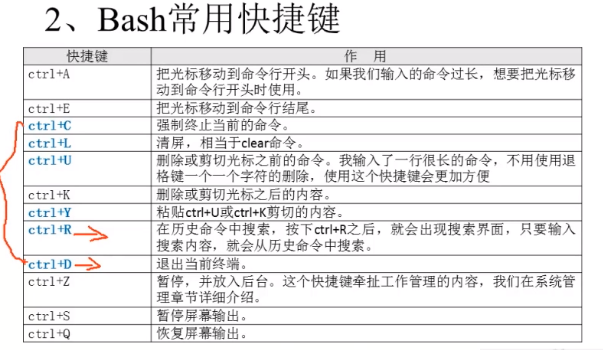
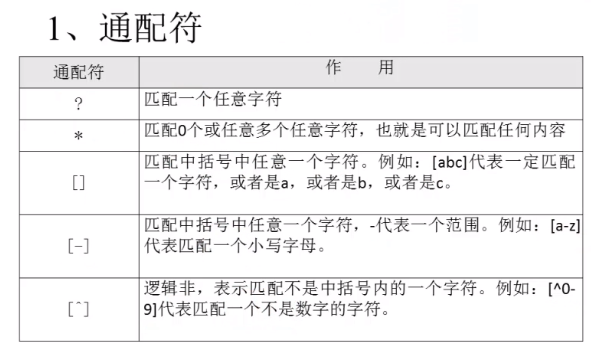
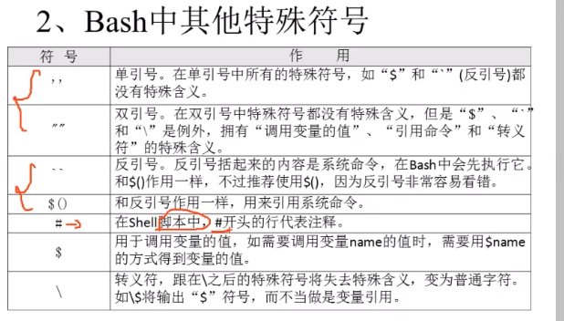
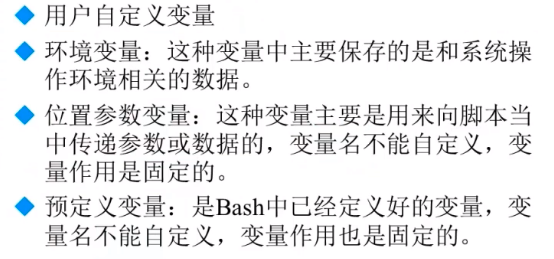
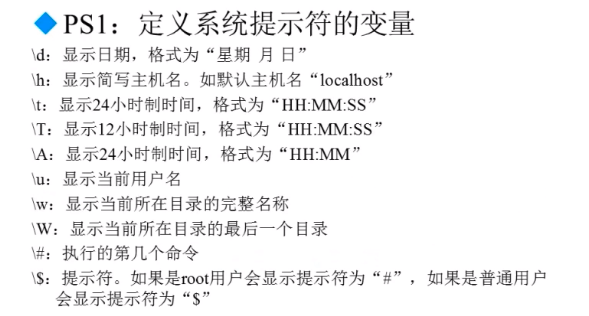
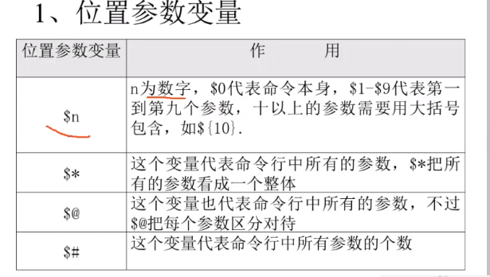
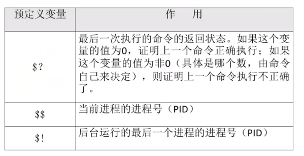
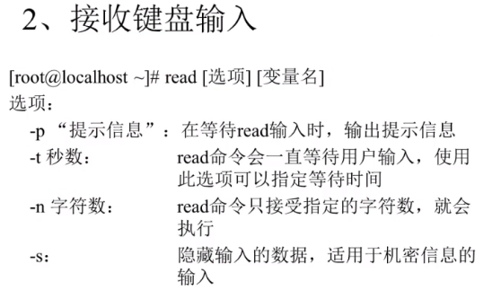
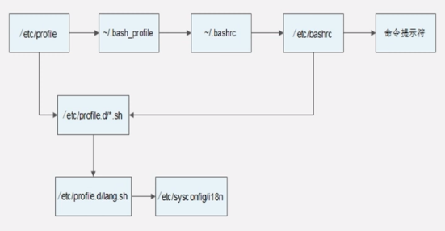
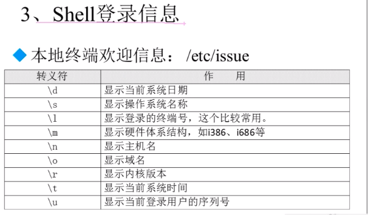

# shell编程

## shell基础

### shell概述

shell的两种主要语法类型有Bourne和C，这两种语法彼此不兼容。Boutne家族主要包括sh、ksh、Bash、psh、zsh；C家族主要包括csh、tcsh。**Bash**与sh兼容，现在使用的Linux就是使用Bash作为用户的基本shell。

Linux支持的shell可以通过/etc/shells进行查看。

### shell脚本的执行方式

1.echo输出命令

echo [选项] [输出内容]

选项：-e   支持反斜杠控制的字符转换

| 控制符 |                                                              |
| ------ | ------------------------------------------------------------ |
| \\\    | 输出\本身                                                    |
| \a     | 输出警告音                                                   |
| \b     | 退格键，也就是向左删除键                                     |
| \c     | 取消输出行末的换行符                                         |
| \e     | escape箭                                                     |
| \n     | 换页符                                                       |
| \r     | 换行符                                                       |
| \t     | 制表符                                                       |
| \v     | 垂直制表符                                                   |
| \0nnn  | 按照八进制ASCII码表输出字符，其中0为数字零，nnn是三位八进制数 |
| \xhh   | 按照十六进制ASCII码表输出字符，其中hh是两位十六进制数        |

2.编写第一个程序helloworld.sh

| #!/bin/bash # 第一个shell脚本程序 # 作者：熊珍龙  echo  '熊珍龙是一个很好的人\n你说是不是？' |
| ------------------------------------------------------------ |
|                                                              |

3.执行脚本

chmod 755 helloworld.sh

./hellworld.sh

### bash的基本功能

#### 历史命令与命令补全

**历史命令**：history [选项] [历史命令保存文件]

选项：-c 	清空历史命令

​		-w	把缓存中的历史命令写入历史命令保存文件~/.bash_history

历史命令默认会保存1000条，可以在环境变量配置文件/etc/profile中进行修改

历史命令的调用：

使用上下箭头调用以前的历史命令

使用!n 重复执行第n条历史命令（n可以通过history命令查看）

使用！！ 重复执行上一条命令

使用!字符串  重复执行最后一条以该字符串开头的命令

**命令与文件补全**：使用tab箭自动补全

#### 命令别名与常用快捷键

临时命令别名:alias 别名=‘原命令’ ,如：alias vi='vim'

查询别名：alias

**命令执行顺序**：

第一顺序位执行用绝对路径或相对路径执行的命令；

第二顺序位执行别名；

第三顺序位执行bash的内部命令（cd等）；

第四顺序位执行按照$PATH环境变量定义的目录查询找到的第一个命令。(查询环境变量：echo $PATH)

**永久让别名生效**：vi ~/.bashrc

删除别名：unalias 别名

#### 输入输出重定向

- 标准输入输出

  | 设备   | 设备文件名  | 文件描述符 | 类型         |
  | ------ | ----------- | ---------- | ------------ |
  | 键盘   | /dev/stdin  | 0          | 标准输入     |
  | 显示器 | /dev/stdout | 1          | 标准输出     |
  | 显示器 | /dev/stderr | 2          | 标准错误输出 |

- 输出重定向

| 类型                       |               符号               | 作用                                                      |
| -------------------------- | :------------------------------: | --------------------------------------------------------- |
| 标准输出重定向             |      命令>文件；命令>>文件       | 以覆盖/追加方式把命令正确输出输入到指定文件或设备中       |
| 标准错误输出重定向         | 错误命令 2>文件;错误命令 2>>文件 | 以覆盖/追加方式把命令错误输出输入到指定文件或设备中       |
| 正确输出和错误输出同时保存 |     命令 &>文件;命令 &>>文件     | 以覆盖/追加方式把命令正确和错误输出输入到指定文件或设备中 |
| 正确输出和错误输出同时保存 |      命令>>文件1  2>>文件2       | 把正确的输出追到到文件1，把错误的追加到文件2              |

注意：&>/dev/null  一般在需要执行命令，但不想输出时，可以使用这个命令，如ls &>/dev/null

#### 多命令顺序执行与管道符

- 多命令顺序执行：

;	命令1;命令2	多个命令顺序执行，命令之间没有任何逻辑关系

&&	命令1&&命令2	逻辑与，当命令1正确执行命令2才会执行，1不正确执行则2不会执行

||	命令1||命令2	逻辑或，当命令1执行不正确时命令2才执行，1正确则2不执行

- 管道符：命令1的**正确输出**作为命令2的操作对象

  命令格式：命令1 | 命令2

- grep [选项] 搜索内容  文件名

  选项：

  -i	忽略大小写

  -n	输出行号

  -v	反向查找

  --color=auto	搜索出的关键字用颜色显示

如：grep -n --color=auto xzl /etc/passwd

- 管道符和grep一般搭配使用

#### 通配符与其他特殊符号

### bash变量

#### 用户自定义变量

- 变量名称可以是字母、数字和下划线组成，但不能以数字开头
- 在Bash中，变量默认类型都是字符串型，如果要进行数值运算，则必须指定变量类型为数值型
- 变量用等号连接值，等号左右两侧不能有空格
- 变量的值如果有空格，需要使用单引号或双引号包括
- 在变量的值中，可以使用\转义符
- 如果需要增加变量的值，那么可以进行变量值的叠加，不过变量需要用双引号包含"$变量名"或用${变量名}包含,如:aa="$aa"456
- 如果是把命令的结果作为变量值赋予变量，则需要使用$()包含命令，如name=$(date)
- 环境变量名建议大写，便于区分
- 变量调用：$后面接变量名

set:查看系统中所有变量

unset name:删除变量

#### 环境变量

环境变量在当前shell和子shell中有效，如果写入配置文件，则对所有shell都生效，查看系统进程层级：pstree

- 设置环境变量

  export 变量名=变量值

  env	查询所有变量

  unset变量名	删除变量

- 特殊系统环境变量

  - PATH：系统查找命令的路径，可以通过echo $PATH查看；

    一般添加环境变量方式【临时，需要永久要修改配置文件】：PATH="$PATH":/home/xzl/sh

  - PS1:通过set命令查看，可以定义系统提示符的变量，如值为：PS1='\[\e]0;\u@\h: \w\a\]${debian_chroot:+($debian_chroot)}\[\033[01;32m\]\u@\h\[\033[00m\]:\[\033[01;34m\]\w\[\033[00m\]\$ '

    

#### 位置参数变量

| #!/bin/bash  sum=$(($1+$2)) echo $sum            |
| ------------------------------------------------------------ |
| 则在命令行输入 ./canshu.sh 11 12后，则会将参数传递进入进去进行计算 |

#### 预定义变量

### 环境变量配置文件

环境变量配置文件中主要定义了对系统操作环境生效的系统默认环境变量，如PATH、HISTSISE、PS1HOSTNAME等

- source命令：source 配置文件或 . 配置文件，可以使配置文件立即生效。

- 主要环境变量配置文件
  - /etc/profile 全局有效
  - /etc/profile.d/*.sh 全局有效
  - ~/.bash_profile  当前用户有效
  - ~/.bashrc  当前用户有效
  - /etc/bashrc  全局有效
- 调用顺序

- 其他配置文件
  - ~/.bash_logout:注销时生效的环境变量配置文件
  - ~/.bash_history：历史命令保存配置文件

登陆后欢迎信息：/etc/motd。不管是本地登录，还是远程登录，都可以显示此欢迎信息